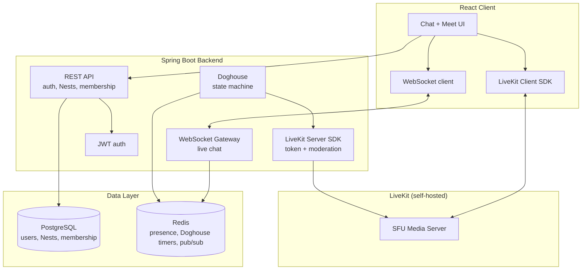

# Architecture

This page explains what The Nest actually is and how the pieces fit
together, as things stand right now. For the product thinking behind it,
see [product/scope.md](product/scope.md), [principles.md](product/principles.md),
[glossary.md](product/glossary.md), and [ux-philosophy.md](product/ux-philosophy.md).

## The shape of the system

A React frontend talks to a Spring Boot backend over REST and, now,
over a live WebSocket connection too. Login/signup, creating and joining
Nests, adding and removing people, and now real chat — sending messages,
replies, and reactions, delivered live to everyone in the Nest — are all
real, backed by Postgres.

Voice meetings and the Doghouse mute feature are designed and built in
the frontend already, but still run on fake, in-memory data rather than
talking to a server — that's the next piece to wire up.

## The stack

- **Frontend**: React, built with Vite and Tailwind, written in
  TypeScript.
- **Backend**: Spring Boot 4 on Java 21, using Maven.
- **Login**: the backend issues its own JWTs from an email + password —
  no dependency on Google/GitHub/etc. to sign in.
- **Database changes**: handled through Liquibase, so every schema
  change is a reviewable, ordered file rather than "whatever Hibernate
  guesses."
- **Chat delivery**: messages are sent over REST and persisted straight
  away; everyone else in the Nest gets them live over a WebSocket
  (STOMP), no polling. Joining a Nest's chat means subscribing to that
  Nest's own channel, and the server checks you're actually a member
  before letting the subscription through.
- **Voice/video**: will run on LiveKit, self-hosted. Not connected yet.
- **PostgreSQL** holds anything that needs to last: accounts, Nests,
  who's in them, and eventually chat history.
- **Redis** will hold anything short-lived: who's currently online, an
  active Doghouse countdown, that kind of thing. Not in use yet.

## How the product is modeled

- **A user** is just an account — email and password. Anyone can find
  and message anyone else directly; there's no invite step required
  just to say hello.
- **A Nest** is the one and only container in the app. There's no
  concept of an organization or workspace above it, and no channels
  inside it — a Nest is a flat group of people with an owner, a member
  list, and an invite code. It doesn't even need a name: an unnamed
  Nest just shows the names of the people in it instead. That's also
  how direct messages and group chats work — they're not a separate
  thing, just a Nest that happens to be unnamed (or later gets a name).
- **Joining a Nest** happens one of three ways: someone adds you
  directly, you use an invite code, or someone starts a conversation
  with you. Starting a 1:1 chat with the same person twice reuses the
  same Nest instead of creating a duplicate; starting a group chat
  always creates a fresh one, even with the same people.
- **Chat** is the persistent text conversation inside a Nest. Sending a
  message, replying to one, and reacting with an emoji are all real —
  saved to Postgres and pushed live to everyone else currently in that
  Nest. Reactions are per-person (so reacting twice with the same emoji
  removes it, it doesn't double-count) and message history can be paged
  back through rather than loading everything at once.
- **Meet** is a casual, drop-in voice/video call tied to a Nest — not
  something you schedule ahead of time. Not hooked up to LiveKit yet.
- **Doghouse** is the signature bit: during a call, you can send someone
  to the "doghouse," which mutes them for everyone to see, for a set
  amount of time — like saying "we're talking about you" out loud
  instead of muting them secretly. It has to ship with real limits
  attached: a cooldown so people can't be piled on, a cap on how many
  people can be muted at once, a personal opt-out that's always
  respected, and a way for the Nest's owner to let someone out early.
  Right now this all runs in the browser as a simulation; the real
  version needs to live on the server (a Redis-backed timer, an actual
  LiveKit mute) so it can't be faked and survives a page refresh.

## How big this needs to be

This is built to run as a single, self-hosted instance — the kind of
thing you'd run for your friend group or team on one server, not a
platform serving many unrelated organizations at scale. That means
normal good practice (indexes, connection pooling, not doing anything
obviously wasteful) but no effort spent on horizontal scaling,
multi-region deployment, or handling huge concurrent load.
