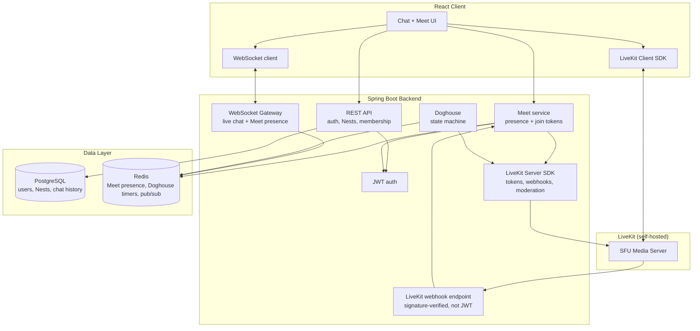

# Architecture

This page explains what The Nest actually is and how the pieces fit
together, as things stand right now. For the product thinking behind it,
see [product/scope.md](product/scope.md), [principles.md](product/principles.md),
[glossary.md](product/glossary.md), and [ux-philosophy.md](product/ux-philosophy.md).

## The shape of the system

A React frontend talks to a Spring Boot backend over REST and, now,
over a live WebSocket connection too. Login/signup, creating and joining
Nests, adding and removing people, real chat — sending messages,
replies, and reactions, delivered live to everyone in the Nest — and now
Meet — joining/leaving a Nest's drop-in call, backed by a self-hosted
LiveKit SFU — are all real, backed by Postgres and Redis.

The Doghouse mute feature is designed and built in the frontend already,
but still runs on fake, in-memory data rather than talking to a server —
that's the next piece to wire up.

## The stack

- **Frontend**: React, built with Vite and Tailwind, written in
  TypeScript.
- **Backend**: Spring Boot 4 on Java 21, using Maven.
- **Login**: the backend issues its own JWTs from an email + password —
  no dependency on Google/GitHub/etc. to sign in.
- **Database changes**: handled through Liquibase, so every schema
  change is a reviewable, ordered file rather than "whatever Hibernate
  guesses."
- **Chat delivery**: messages are sent over REST and persisted straight
  away; everyone else in the Nest gets them live over a WebSocket
  (STOMP), no polling. Joining a Nest's chat means subscribing to that
  Nest's own channel, and the server checks you're actually a member
  before letting the subscription through.
- **Voice/video**: runs on LiveKit, self-hosted (`--dev` mode locally, a
  real deployment needs its own key/secret and TURN/TLS config). The
  backend never talks to the SFU's media path directly — it only mints
  short-lived, room-scoped join tokens via the LiveKit server SDK and
  receives signed webhooks back for reconciliation.
- **PostgreSQL** holds anything that needs to last: accounts, Nests,
  who's in them, and chat history.
- **Redis** holds anything short-lived: who's currently in a Meet call
  right now (a hash per Nest, `meet:{nestId}:participants`), and
  eventually an active Doghouse countdown.

## How the product is modeled

- **A user** is just an account — email and password. Anyone can find
  and message anyone else directly; there's no invite step required
  just to say hello.
- **A Nest** is the one and only container in the app. There's no
  concept of an organization or workspace above it, and no channels
  inside it — a Nest is a flat group of people with an owner, a member
  list, and an invite code. It doesn't even need a name: an unnamed
  Nest just shows the names of the people in it instead. That's also
  how direct messages and group chats work — they're not a separate
  thing, just a Nest that happens to be unnamed (or later gets a name).
- **Joining a Nest** happens one of three ways: someone adds you
  directly, you use an invite code, or someone starts a conversation
  with you. Starting a 1:1 chat with the same person twice reuses the
  same Nest instead of creating a duplicate; starting a group chat
  always creates a fresh one, even with the same people.
- **Chat** is the persistent text conversation inside a Nest. Sending a
  message, replying to one, and reacting with an emoji are all real —
  saved to Postgres and pushed live to everyone else currently in that
  Nest. Reactions are per-person (so reacting twice with the same emoji
  removes it, it doesn't double-count) and message history can be paged
  back through rather than loading everything at once.
- **Meet** is a casual, drop-in voice/video call tied to a Nest — not
  something you schedule ahead of time. Joining posts to the backend,
  which checks you're actually a member of the Nest, registers your
  presence in Redis, and hands back a short-lived LiveKit join token
  scoped to that Nest's room and your identity only. Everyone else in
  the Nest sees you join/leave live over the same WebSocket pattern
  Chat uses (`/topic/nests/{nestId}/meet`). Presence is ephemeral by
  design — there's no call history table, matching Meet's drop-in
  nature — and if a participant's browser vanishes without calling
  "leave" (a crash, a closed tab), a signed webhook from LiveKit itself
  reconciles the Redis state rather than leaving a stale participant
  behind. Because dropping into a call isn't meant to pull you away
  from anything else, being on a Meet call isn't tied to having that
  Nest's screen open: once joined, the frontend keeps the call running
  as a small floating control that follows you around the app,
  including while you're looking at a different Nest entirely. That
  means the LiveKit client connection is owned above any single Nest's
  screen (at the app-shell level), not created and destroyed as you
  navigate between Nests, and the Nest list needs a way to show which
  other Nest currently has a call running before you switch to it.
  Mic starts on when you join; camera starts off and is a manual
  toggle, so joining a casual call never surprises anyone with an
  unannounced camera. The floating control's collapsed pill is meant
  for ambient awareness only; an expand action opens a larger view with
  real video tiles at a usable size for actually looking at people, and
  collapses back down to the pill rather than being a separate page.
- **Doghouse** is the signature bit: during a call, you can send someone
  to the "doghouse," which mutes them for everyone to see, for a set
  amount of time — like saying "we're talking about you" out loud
  instead of muting them secretly. It has to ship with real limits
  attached: a cooldown so people can't be piled on, a cap on how many
  people can be muted at once, a personal opt-out that's always
  respected, and a way for the Nest's owner to let someone out early.
  Because a call can be visible from anywhere in the app now, not just
  from that Nest's own screen, the mute has to render in that same
  floating control too — if the target had wandered off to another
  Nest, hiding the mute there would let it happen without them actually
  seeing it, which defeats the entire point of doing it out loud
  instead of secretly. Right now this all runs in the browser as a
  simulation; the real version needs to live on the server (a
  Redis-backed timer, an actual LiveKit mute) so it can't be faked and
  survives a page refresh.

## How big this needs to be

This is built to run as a single, self-hosted instance — the kind of
thing you'd run for your friend group or team on one server, not a
platform serving many unrelated organizations at scale. That means
normal good practice (indexes, connection pooling, not doing anything
obviously wasteful) but no effort spent on horizontal scaling,
multi-region deployment, or handling huge concurrent load.

## How it ships

`develop` is the default working branch; `main` only moves when
something is actually meant to go live. Pushing to `main` triggers
[.github/workflows/cd.yml](../.github/workflows/cd.yml): it builds the
backend and frontend as Docker images, pushes them to GHCR tagged with
the commit SHA, then SSHes into the self-hosted VM and tells
`docker compose` (using [infra/docker-compose.prod.yml](../infra/docker-compose.prod.yml))
to pull the new images and recreate the running containers. Every PR
and push to `develop`/`main` also runs [.github/workflows/ci.yml](../.github/workflows/ci.yml)
(backend tests against real Postgres/Redis service containers, frontend
lint + typecheck + build) — that's the gate before anything reaches
`main`.

Caddy sits in front of the frontend and backend on the VM as the single
public-facing edge — plain HTTP against the VM's bare IP by default,
automatic HTTPS the moment a domain is pointed at it (one env var, no
config change). LiveKit is the one piece of this still running in local
dev's `--dev` mode with its fixed key/secret pair even in this
production setup — generating a real key/secret pair and TURN/TLS config
is a deliberate, tracked follow-up, not solved yet.
