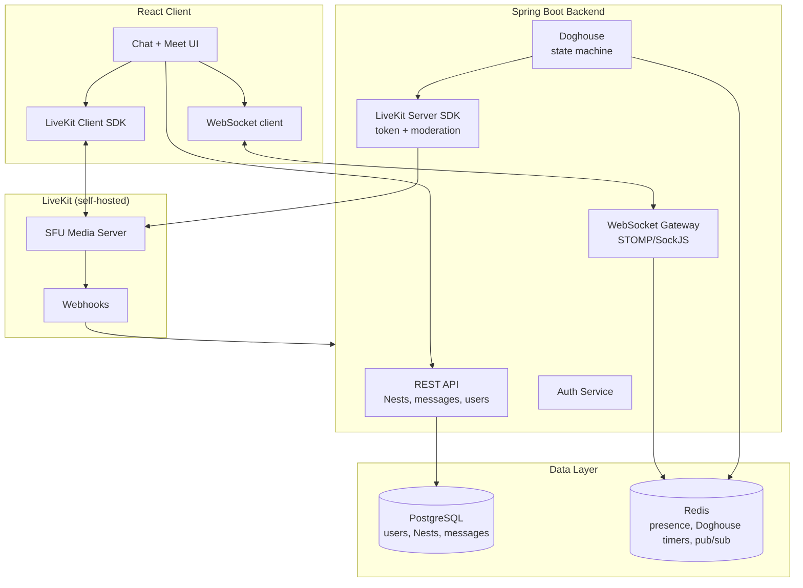

# Architecture

## System overview

## Stack

| Layer | Choice | Why |
|---|---|---|
| Frontend | React | Pairs with LiveKit's `livekit-client` / `@livekit/components-react`; custom UI on top for sub-features. |
| Backend | Spring Boot | REST for durable CRUD, WebSocket/STOMP for live chat + moderation event broadcast. |
| Real-time media | LiveKit (self-hosted) | See [../decisions/0002-realtime-media-livekit.md](../decisions/0002-realtime-media-livekit.md). |
| Durable data | PostgreSQL | Users, Nests, chat history, scores. |
| Ephemeral/live data | Redis | Presence, Doghouse timers (TTL-based), pub/sub for multi-instance event fan-out. |

## Scale posture

Per [../product/scope.md](../product/scope.md), this is architected for a
single self-hosted deployment with good practices (indexing, connection
pooling, TTL-based ephemeral state instead of in-memory timers) — not for
horizontal scale or multi-region. The Redis pub/sub layer is included
because it's needed correctness-wise the moment there's more than one
backend instance, not as premature scaling work.

## Doghouse state machine

Must be server-owned (not client-side `setTimeout` as in the throwaway
mockup) so it survives refreshes/disconnects and stays correct if the
backend ever runs as more than one instance.

Approach: Redis key `doghouse:{nestId}:{userId}` set with a TTL on
trigger; expiry (via keyspace notification or short poll) fires the
unmute + broadcast.

## Open questions

- Auth approach: own JWT issuance vs. an OAuth provider (Google/GitHub
  login) — not yet decided, affects onboarding friction directly.
- Deployment target: existing Oracle Cloud infra is the working
  assumption but not yet finalized.
